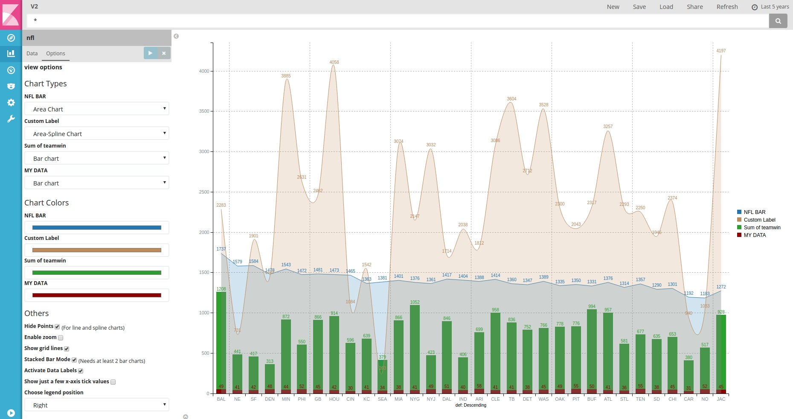
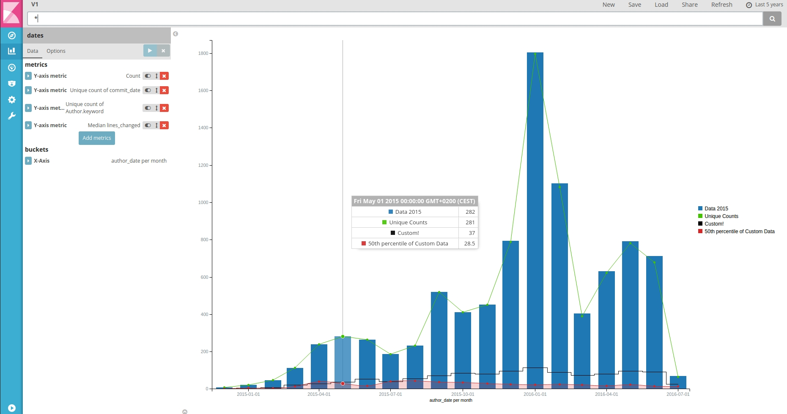
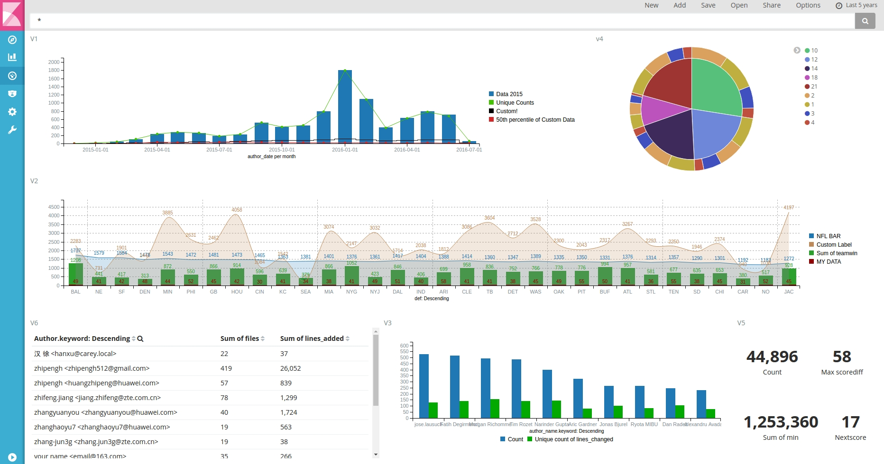

# C3JS Visualizations Plugin for Kibana 5 

### About
This is a plugin for Kibana5+. Has been developed and tested on Kibana 5.0.0-rc-1 and 5.1.0 version. The plugin uses C3JS library (D3-based charts).



### Usage
Installation steps:
```
$ cd KIBANA_HOME/plugins
$ git clone https://github.com/mstoyano/kbn_c3js_vis.git c3_charts
$ cd c3_charts
$ npm install
```
> **Note:** If you can not see the plugin in the plugin list, or get kibana warning like "**Plugin "c3_charts" was disabled because it expected Kibana version "5.1.0", and found "5.0.0-rc1**" please modify package.json file and put your kibana version.

Unistall:
```
$ bin/kibana plugin  --remove c3_charts
```

### Features
* Up to 5 different metrics
* Represent category data or timeseries
* Color and chart type customization
* Tooltip
* Mix several chart types in the same visualization
* Data focus when place mouse cursor above the legend
* Animation effect when legend click
* Unload and reload data once the visualization is loaded (in your dashboard)
* Options
  * Zoom
  * Stacked Bar Mode
  * Data Labels
  * Grid
  * Change legend position (right or bottom)
  * Hide chart points
  * Show a few x-axis tick values 

### Screenshots



### Contributions (Work in progress)
Anyone is welcome to contribute to my project. There are various ways you can contribute:

1. Raise an [Issue](https://github.com/mstoyano/kbn_c3js_vis/issues) on GitHub
2. Send me a Pull Request with your bug fixes and/or new features
3. Contact via email: **mom4il13@hotmail.com**

### Feedback is highly appreciated!
Please let me receive your screenshots using this plugin and your project purposes. That would help me a lot for my thesis degree. You can send me a email or raise an [Issue](https://github.com/mstoyano/kbn_c3js_vis/issues) on GitHub. Thank you in advance and best regards.
